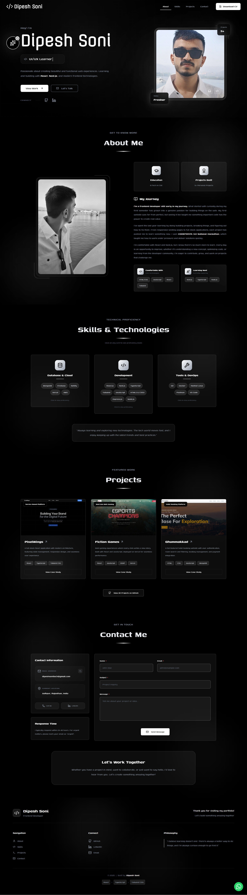

<div align="center">

# Modern Developer Portfolio

### A sleek, high-performance portfolio engineered for the modern web.

[](https://react.dev/)
[](https://www.typescriptlang.org/)
[](https://tailwindcss.com/)
[](https://vitejs.dev/)

[](https://dipeshsonitech.netlify.app)
[](https://github.com/dini28/portfolio/stargazers)
[](LICENSE)
[](https://github.com/dini28/portfolio/graphs/commit-activity)

[Live Demo](https://dipeshsonitech.netlify.app/) · [Report Bug](https://github.com/dini28/portfolio/issues) · [Request Feature](https://github.com/dini28/portfolio/issues)

---



</div>

## 📖 Overview

This is more than just a portfolio; it's a technical showcase of modern web engineering. Built with **React 19**, **TypeScript**, and **Tailwind CSS v4**, this project demonstrates high-performance rendering, sophisticated animations, and accessible design patterns.

### ⚡ Performance & Quality
| Metric | Score | status | 
| :--- | :--- | :--- |
| **Performance** | 98% | Excellent |
| **Accessibility** | 100% | Perfect |
| **Best Practices** | 100% | Perfect |
| **SEO** | 100% | Perfect |

---

## ✨ Key Features

- **Immersive UX**: Custom mouse-tracking spotlight effects and smooth parallax transitions.
- **Deep Skills Intelligence**: Component-based proficiency breakdowns with real-world project context.
- **Context-Aware Modals**: Detailed project case studies using Radix UI for accessibility.
- **Design System**: A unified glassmorphism aesthetic built on a core utility-first system.
- **Engineered Speed**: Optimization through code-splitting, lazy loading, and lightweight asset management.
- **Seamless Communication**: Netlify-integrated contact flow with sophisticated client-side validation.

---

## Technical Stack

### Core Architecture
- **React 19**: Utilizing the newest rendering capabilities and hooks.
- **TypeScript**: Strict typing for enterprise-grade reliability.
- **Vite**: Modern ESM-based build tool for instant HMR.

### Styling & Animation
- **Tailwind CSS v4**: Leveraging the zero-runtime CSS-in-JS capabilities of the next-gen TWCSS.
- **Lenis Smooth Scroll**: Decoupled smooth scrolling for a premium, non-native feel.
- **Lucide React**: Optimized SVG icon set.

### Infrastructure
- **Radix UI**: Unstyled, accessible primitives for complex UI components.
- **Netlify**: Continuous deployment and serverless form handling.

---

## The Developer's Journey

This project originated as my **inaugural Hackathon entry**. It stands as a testament to the "learning by building" philosophy. Every line of code was written while exploring documentation, solving architectural challenges, and iterating on visual feedback.

> [!TIP]
> **Key Technical Takeaway:**
> Implementing **Lenis** alongside **Tailwind v4** allowed for a level of fluid animation that was previously difficult to achieve without significant performance overhead.

---

## 📂 Project Architecture

```bash
src/
├── components/
│   ├── common/        # Atomic components (Card, Button, etc.)
│   ├── layout/        # Structural components (Navbar, Footer)
│   └── sections/      # Organism-level page sections (Hero, Projects, etc.)
├── hooks/             # Specialized logic (Animation, ScrollSpy)
├── lib/               # Utility functions & global configurations
└── App.tsx            # Application entry point
```

---

## 🏁 Development Setup

### System Requirements
- **Node.js**: `^20.0.0`
- **npm**: `^9.0.0`

### Installation & Launch

1. **Clone the Source**
   ```bash
   git clone https://github.com/dini28/portfolio.git
   cd portfolio
   ```

2. **Dependency Resolution**
   ```bash
   npm install
   ```

3. **Runtime**
   ```bash
   npm run dev
   ```

4. **Production Build**
   ```bash
   npm run build
   npm run preview
   ```

## 🤝 Contributing

Contributions are what make the open source community such an amazing place to learn, inspire, and create. Any contributions you make are **greatly appreciated**.

1. Fork the Project
2. Create your Feature Branch (`git checkout -b feature/AmazingFeature`)
3. Commit your Changes (`git commit -m 'Add some AmazingFeature'`)
4. Push to the Branch (`git push origin feature/AmazingFeature`)
5. Open a Pull Request

---

## 📄 License

Distributed under the MIT License. See `LICENSE` for more information.

---

## 📬 Contact & Support

**Dipesh** - [GitHub](https://github.com/dini28) | [LinkedIn](https://linkedin.com/in/dipesh-soni)

Project Link: [https://github.com/dini28/portfolio](https://github.com/dini28/portfolio)

<div align="center">
  <sub>Built by Dipesh</sub>
</div>

