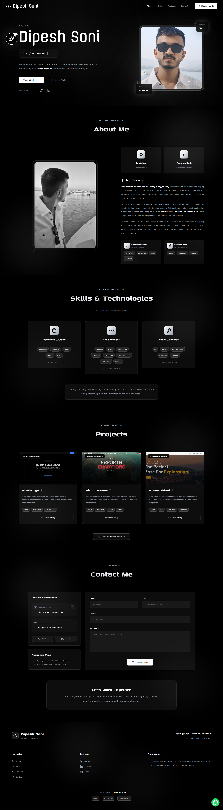

<div align="center">

  

  # ⚡ Dipesh Soni — Personal Portfolio

  **A modern, high-performance developer portfolio built with Next.js 15, React 19, TypeScript, and Tailwind CSS v4.**

  [](https://dipeshsoni.vercel.app/)
  [](https://nextjs.org/)
  [](https://react.dev/)
  [](https://www.typescriptlang.org/)
  [](https://tailwindcss.com/)
  [](LICENSE)

  <br />

  [**🌐 Explore Live Site**](https://dipeshsoni.vercel.app/) &nbsp;•&nbsp; [**🐛 Report Bug**](https://github.com/dini28/Portfolio/issues) &nbsp;•&nbsp; [**✨ Request Feature**](https://github.com/dini28/Portfolio/issues)

  <br />

  

</div>

---

## 🌟 Key Features

- ⚡ **Next.js 15 & React 19 App Router:** Powered by the latest React features and Next.js App Router for optimal server-side rendering and lightning-fast page loads.
- 🎨 **Modern Dark Aesthetic:** Tailored glassmorphism UI built with **Tailwind CSS v4** featuring dynamic visual effects and curated typography.
- 🌀 **Lenis Smooth Scroll:** Silky smooth inertial scrolling integrated across all sections.
- 📬 **Serverless Contact System:** Secure contact form route handler featuring Honeypot anti-spam protection, HTML escaping, and automated Gmail delivery via **Nodemailer**.
- 🌐 **Interactive 3D Skill Canvas & Animations:** Immersive interactive skill cards, custom hooks, and dynamic micro-interactions.
- 📱 **Fully Responsive & Accessible:** Built following accessibility (a11y) standards, semantic HTML5, and full cross-device mobile responsiveness.
- 📊 **Vercel Analytics Integrated:** Real-time insights into user engagement and web performance metrics.

---

## 🛠️ Tech Stack & Tools

| Category | Technology | Description |
| :--- | :--- | :--- |
| **Framework** | [Next.js 15](https://nextjs.org/) (App Router) | React Server Components & Route Handlers |
| **UI Library** | [React 19](https://react.dev/) | Core UI rendering engine |
| **Language** | [TypeScript 5.9](https://www.typescriptlang.org/) | Type safety & enhanced developer experience |
| **Styling** | [Tailwind CSS v4](https://tailwindcss.com/) | Modern utility-first CSS design system |
| **Smooth Scroll** | [Lenis](https://lenis.darkroom.engineering/) | Inertial smooth scrolling integration |
| **Icons & UI** | [Lucide React](https://lucide.dev/) + [Radix UI](https://www.radix-ui.com/) | Accessible icons & unstyled UI primitives |
| **Backend / Mail** | [Nodemailer](https://nodemailer.com/) | Secure SMTP email sending |
| **Analytics** | [Vercel Analytics](https://vercel.com/analytics) | Performance & engagement metrics |
| **Deployment** | [Vercel](https://vercel.com/) | Global CDN hosting & CI/CD deployment |

---

## 📁 Repository Structure

```gfm
portfolio/
├── public/                 # Static assets (images, logos, preview media)
├── src/
│   ├── app/                # Next.js App Router layouts, pages, and API routes
│   │   ├── api/contact/    # Serverless contact form POST handler
│   │   ├── globals.css     # Tailwind CSS v4 import & design system tokens
│   │   ├── layout.tsx      # Root layout with font configuration & Lenis provider
│   │   └── page.tsx        # Main portfolio landing page
│   ├── components/
│   │   ├── common/         # Atomic UI components (Buttons, Cards, Badges)
│   │   ├── layout/         # Shell components (Header navbar, Footer)
│   │   └── sections/       # Page sections (Hero, About, Projects, Skills, Contact)
│   ├── data/               # Structured content data (projects.ts, skills.ts, social.ts)
│   ├── hooks/              # Custom React hooks (scroll spy, animations, layout)
│   └── utils/              # Utility helpers (clsx/tailwind-merge wrapper)
├── .env                    # Environment configuration template
├── next.config.ts          # Next.js configuration
├── package.json            # Dependencies and npm script definitions
└── tsconfig.json           # TypeScript compiler configuration
```

---

## 🚀 Getting Started

### Prerequisites

Ensure you have the following installed on your machine:
- **Node.js:** `>= 20.x`
- **npm:** `>= 9.x` (or `pnpm` / `yarn`)

### Installation & Local Setup

1. **Clone the repository:**
   ```bash
   git clone https://github.com/dini28/Portfolio.git
   cd Portfolio
   ```

2. **Install dependencies:**
   ```bash
   npm install
   ```

3. **Configure Environment Variables:**
   Create a `.env.local` or update `.env` in the root directory:
   ```env
   SMTP_EMAIL=your-email@gmail.com
   SMTP_PASSWORD=your-app-password
   ```

4. **Run Development Server:**
   ```bash
   npm run dev
   ```
   Open [http://localhost:3000](http://localhost:3000) in your browser to view the portfolio.

---

## 📜 Available Scripts

| Command | Action |
| :--- | :--- |
| `npm run dev` | Starts local development server with HMR |
| `npm run build` | Creates an optimized production build |
| `npm run start` | Runs the production server using built assets |
| `npm run lint` | Runs ESLint to verify code quality |

---

## ⚙️ Customization

To tailor this portfolio for your own credentials and projects:

- **Personal Details & Bio:** Update `src/components/sections/About.tsx` and `Hero.tsx`.
- **Projects Data:** Edit `src/data/projects.ts` to showcase your projects, descriptions, tech tags, and links.
- **Skills & Tech Stack:** Modify `src/data/skills.ts` to adjust your skillset categories.
- **Social Links:** Update `src/data/social.ts` with your custom social media handles.

---

## 🔒 Security & Performance Features

- **Form Protection:** Includes an invisible Honeypot input alongside HTML sanitization to block bots and XSS attacks.
- **Optimized Assets:** Automatic image & font optimization powered by Next.js for high Web Vitals scores.

---

## 📄 License

This project is licensed under the **MIT License** — feel free to use and modify it for your own portfolio.

---

<div align="center">

  Crafted with ❤️ by **[Dipesh Soni](https://github.com/dini28)**

  [](https://github.com/dini28)
  [](https://linkedin.com/in/dipesh-soni)
  [](https://dipeshsoni.vercel.app/)

</div>

